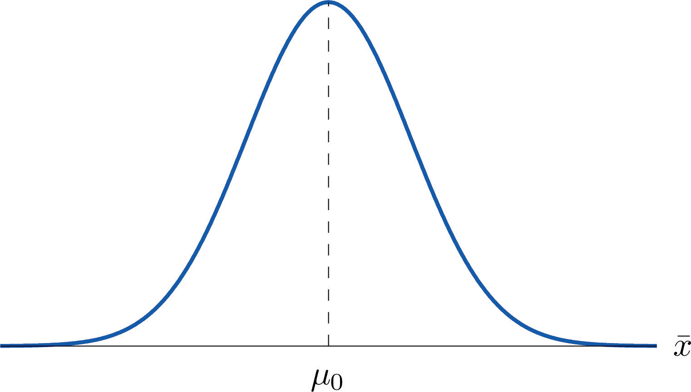
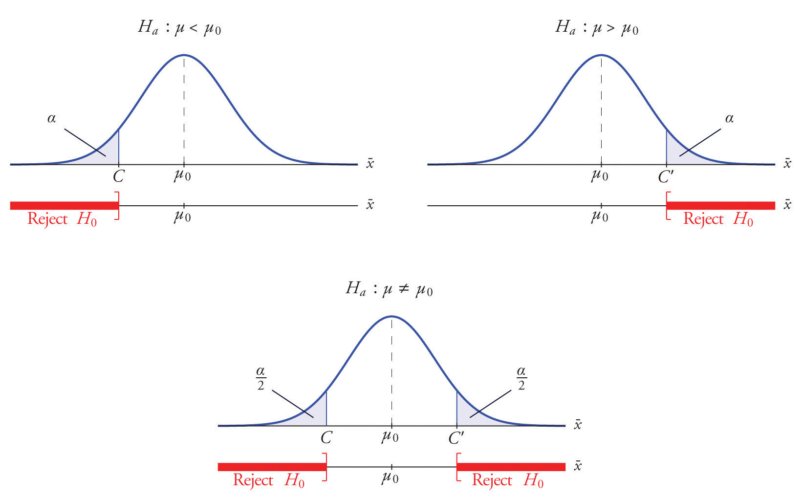
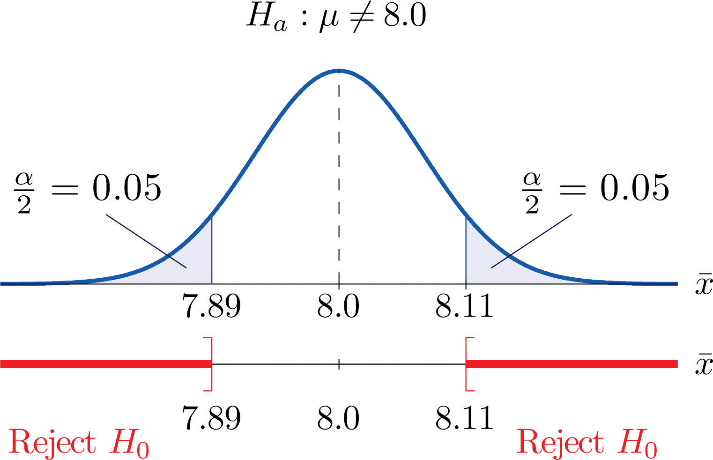

::: {.notes}
How far away from $\mu$ does $\bar X$ have to be in order for the 95% CI not to contain $\mu$?
By the end of next lecture, make sure you have tied your answer to the CI question above to your understanding of HT.
:::

# Agenda

## Previously: Part A summary



## Previously: Part B summary



## Previously: Part C so far

- Confidence intervals for population means
- Confidence intervals for population proportions
- Interpreting confidence intervals



<!--
## OpenIntro companion reading

- Best conceptual match in OpenIntro: Chapter 5, Section 5.3, especially the parts on
  - the hypothesis testing framework
  - testing hypotheses using confidence intervals
  - decision errors
  - formal testing using p-values
  - choosing a significance level
- For later mechanics of one-sample mean tests, the natural OpenIntro continuation is Chapter 7, Section 7.1.
-->

## Overview

- This lecture
    - the logic and language of hypothesis testing
    - setting up a test for a population mean
- Why this matters: hypothesis testing is how economists and scientists use data to evaluate claims in policy and markets.
- What you will learn:
    1. the logic of hypothesis testing: null vs. alternative hypotheses
    2. how to set up and interpret a test for the population mean
    3. how the sample mean, sample size, and variability determine the outcome

## Connection to confidence intervals

- Confidence intervals and hypothesis tests are closely related.
- If a hypothesized value is far enough from the estimate, it will fall outside the confidence interval.
- Later, we will make that connection precise.

- Big picture:
    - A confidence interval asks: which parameter values are reasonably consistent with the data?
    - A hypothesis test asks: is one particular parameter value so inconsistent with the data that we should reject it?

# Part I: Basic Ideas

## Motivating example

Here is the basic idea of hypothesis testing:

1. A transit agency claims that the average rush-hour wait time for a certain bus route is at most 6 minutes
2. You sample 10 waiting times and find a sample average of 7.2 minutes. Is that consistent with their claim?
3. What if the sample average were 8.5 minutes instead? Would that be more or less in support of their claim?
4. What if the sample average of 7.2 minutes came from 1,000 observations instead of 10? Would that be stronger evidence?
5. Would it be enough evidence for you not to believe their 6-minute claim?
6. How far above 6 minutes would the sample average have to be before you decide the claim is not credible?

. . .

HT is a framework for thinking about such questions.

## The core question

- In a hypothesis test, we do **not** ask whether the sample exactly matches the claim.
- We ask whether the sample would be surprising if the claim were true.

. . .

- If the sample would be unsurprising, we do not reject the claim.
- If the sample would be very surprising, we reject it.

## Hypotheses

- A **hypothesis test** is a statistical procedure in which a choice is made between a null hypothesis and an alternative hypothesis based on information in a sample.
- A **hypothesis** is a statement about a population parameter.
- In this course, hypotheses are about unknown population means or proportions.

## Two possible conclusions

- A hypothesis test ends with one of two conclusions:
    1. reject $H_0$
    2. fail to reject $H_0$

. . .

- We do **not** say "accept $H_0$."
- The data may simply be insufficient to reject it.

## Null and alternative hypothesis

- The **null hypothesis**, denoted $H_0$, is the statement about the population parameter that is assumed to be true unless there is convincing evidence to the contrary.

- The **alternative hypothesis**, denoted $H_a$, is a statement about the population parameter that is contradictory to the null hypothesis, and is accepted as true only if there is convincing evidence in favor of it.

## Practical convention

- In this course, the hypothesis with the equality sign is the null hypothesis.
- That matches Shafer and Zhang's presentation and makes the setup easier to read.

. . .

- So the null typically looks like:
$$H_0:\mu=\mu_0$$

- The alternative then takes one of three forms:
$$H_a:\mu<\mu_0,\qquad H_a:\mu>\mu_0,\qquad H_a:\mu\neq\mu_0$$

. . .

- Use $<$ when the concern is that the true value is lower.
- Use $>$ when the concern is that the true value is higher.
- Use $\neq$ when deviations in either direction matter.

## Example: cannabis vendor

::: {.callout-tip title="Cannabis vendor"}
A Canadian cannabis vendor claims that their product contains 1 gram, on average, per unit sold.

The vendor does not claim that each unit sold contains *exactly* 1 gram, only that, *on average* each unit contains 1 gram. One unit might contain 0.975 grams, another 1.04 grams, etc.

You want to test their claim to see whether they are honest or not.

In other words: *you wish to test the null hypothesis that $\mu=1$ against the alternative hypothesis $\mu\ne 1$.*
:::

## Example: union wages

::: {.callout-tip title="Union wages"}
A union organizer claims that the average income of unionized carpenters exceeds the average income of nonunionized carpenters.

Let $\mu_1$ be the unknown population average income of unionized carpenters and $\mu_2$ be that for nonunionized carpenters.

The union organizer thus wants to test
$$H_0: \mu_1-\mu_2=0$$
versus
$$H_a: \mu_1-\mu_2>0.$$
:::

## Example: respirator testing

::: {.callout-tip title="Respirator"}
1. A manufacturer claims its respirator delivers pure air for 75 minutes on average
2. A government regulatory agency wants to verify that the average time is not less than 75 minutes
3. It would select a random sample of respirators, compute the mean time they deliver pure air, and compare it to 75

The null hypothesis is $H_0:\mu=75$.

The alternative hypothesis is the contradictory statement $H_a:\mu<75$.
:::

## Example: textbook prices

::: {.callout-tip title="Textbook prices"}
*Shafer and Zhang, Chapter 8, Example 1.*

A publisher of college textbooks claims that the average price of all hardbound college textbooks is CAD 127.50. A student group believes that the actual mean is higher and wishes to test their belief. State the relevant null and alternative hypotheses.

- The default option is to accept the publisher's claim unless there is compelling evidence to the contrary. Thus the null hypothesis is $H_0:\mu=127.50.$

- Since the student group thinks that the average textbook price is greater than the publisher's figure, the alternative hypothesis in this situation is $H_a:\mu>127.50$.

- Shafer and Zhang note: for our purpose, this will be the same as $H_0:\mu \leq 127.50$ versus $H_a:\mu > 127.50$.

:::

# Part II: Logic of Hypothesis Testing

## First principle of hypothesis testing

- The **first principle of hypothesis testing** is that the test procedure is built on the initial assumption that $H_0$ is true.

- Under $H_0:\mu = \mu_0$, we can thus visualize the sampling distribution for $\bar X$ as:

{width="50%"}

- For this figure:
  - $\bar X$ follows a normal distribution (CLT).
  - The mean of $\bar X$ is $\mu_0$ (first principle of HT).
  - If $H_0$ is true, $\bar X$ is likely to take a value near $\mu_0$.
  - If $H_0$ is true, $\bar X$ is unlikely to take values far away.

## What makes evidence stronger?

- A sample mean farther from $\mu_0$ is stronger evidence against $H_0$.
- A larger sample size is stronger evidence against $H_0$, holding the gap fixed.
- Lower variability makes the evidence stronger, holding the gap fixed.

## Decision procedure

Our *decision procedure* therefore reduces simply to:

- If $H_a:\mu<\mu_0$, reject $H_0$ when $\bar X$ is far to the left.
- If $H_a:\mu>\mu_0$, reject $H_0$ when $\bar X$ is far to the right.
- If $H_a:\mu \neq \mu_0$, reject $H_0$ when $\bar X$ is far from $\mu_0$.

## Types of tests

- If $H_a$ has the form $\mu \neq \mu_0$, the test is called a **two-tailed test**.
- If $H_a$ has the form $\mu < \mu_0$, the test is called a **left-tailed test**.
- If $H_a$ has the form $\mu > \mu_0$, the test is called a **right-tailed test**.
- Left- or right-tailed tests are also called **one-tailed tests**.

## Rare events and significance

- A hypothesis test rejects $H_0$ when the observed sample result would be rare if $H_0$ were true.
- The cutoff for "rare" is the **significance level**, denoted $\alpha$.

. . .

- Common choices are $\alpha=0.10$, $\alpha=0.05$, and $\alpha=0.01$.
- Smaller $\alpha$ means we demand stronger evidence before rejecting $H_0$.

## Rejection regions

- A **rejection region** is an interval, or union of intervals, such that the null hypothesis is rejected if and only if the sample statistic lies in that region.
- Left-tailed regions look like $(-\infty,C]$ (respirator/NFT example).
- Right-tailed regions look like $[C,\infty)$.
- Two-tailed regions look like $(-\infty,C] \cup [C',\infty)$ (cannabis example).

. . .

- So once we know the form of $H_a$, we know where to look for evidence against $H_0$.

## Critical values

What's $C$? For a one-tailed test, Shafer and Zhang:

> We are given a small probability, denoted $\alpha$, say 1%, which we take as our definition of "rare event:" an event is "rare" if its probability of occurrence is less than $\alpha$. [...] The critical value $C$ is the value of $\bar X$ that cuts off a tail area $\alpha$ in the probability density curve of $\bar X.$

---

The **critical value(s) of a test of hypotheses** are the number or numbers that determine the rejection region.

{width="70%"}

## Putting the logic together

- Start by assuming $H_0$ is true.
- Use that assumption to describe the sampling distribution of the test statistic.
- Choose how rare is "rare" by fixing $\alpha$.
- Reject $H_0$ only when the sample falls in the rejection region.

## Example: bakery fat content

*Shafer and Zhang, 8, Examples 2 and 3.* (4 minutes)

The recipe for a bakery item is designed to result in a product that contains 8 grams of fat per serving. It is known that the population is normally distributed with standard deviation $\sigma = 0.15$ gram.

The quality control department periodically takes a random sample of 5 products to insure that the production process is working as designed.

1. State the relevant null and alternative hypotheses.
2. Construct the rejection region for the test for the choice $\alpha=0.10.$
3. Explain the decision procedure and interpret it.

---

*1. State the relevant null and alternative hypotheses.*

The default option is to assume that the product contains the amount of fat it was formulated to contain unless there is compelling evidence to the contrary. Thus the null hypothesis is $H_0:\mu=8.0$.

. . .

Since to contain either more fat than desired or to contain less fat than desired are both an indication of a faulty production process, the alternative hypothesis in this situation is that the mean is different from 8.0, so $H_a:\mu \neq 8.0.$

. . .

This will be a two-tailed test.

---

*2. Construct the rejection region*.

We cannot invoke the CLT here, since $n<30$. Instead, we use our knowledge of Section 7.2.

If $H_0$ is true then the sample mean $\bar X$ is normally distributed with mean $8.0$ and standard deviation $\frac{0.15}{\sqrt{5}} \approx 0.067.$

. . .

This is a two-tailed test, so the rejection region consists of two pieces, each with area $\alpha/2 = 0.05$. The regions are $(-\infty,C]$ and $[C',\infty)$.

---

If $\bar X$ were standard normal, the critical values would be -1.645 and +1.645. We unstandardize: we are looking for the number 1.645 times the standard deviation away from the mean.

- $C = 8 - 1.645 \times 0.067 = 7.89$
- $C' = 8 + 1.645 \times 0.067 = 8.11$

---

*3. Explain the decision procedure*

{width="60%"}

---

In words, the decision procedure is:

1. take a sample of size 5 and compute the sample mean $\bar X$
2. if $\bar X$ is 7.89 grams or less, or if it is 8.11 grams or more, then reject the hypothesis that the average amount of fat in all servings of the product is 8.0 grams in favor of the alternative that it is different from 8.0 grams
3. Otherwise do not reject the hypothesis that the average amount is 8.0 grams

---

Shafer and Zhang say:

> The reasoning is that if the true average amount of fat per serving were 8.0 grams then there would be less than a 10% chance that a sample of size 5 would produce a mean of either 7.89 grams or less or 8.11 grams or more. Hence if that happened it would be more likely that the value 8.0 is incorrect.

# Part III: Errors in hypothesis testing

## Two kinds of mistakes

- Because decisions are based on samples, hypothesis tests can make mistakes.
- There are two important ones:
    1. rejecting a true null hypothesis
    2. failing to reject a false null hypothesis

## Type I and Type II errors

- A **Type I error** means rejecting $H_0$ when $H_0$ is actually true.
- A **Type II error** means failing to reject $H_0$ when $H_0$ is actually false.

## Why alpha matters

- The significance level $\alpha$ is the probability of a Type I error.
- So choosing $\alpha=0.05$ means we are willing to use a rule that falsely rejects a true null about 5% of the time in repeated similar samples.

. . .

- Smaller $\alpha$ protects more against false rejection.
- But it also makes rejection harder.

## Why sample size still matters

- With a larger sample, the sampling distribution is tighter.
- That makes it easier to distinguish ordinary sampling variation from genuine evidence against $H_0$.

. . .

- This is why small samples often fail to reject even when the null is false.

## Interpreting "fail to reject"

- "Fail to reject" does **not** mean the null is true.
- It means the sample did not provide strong enough evidence against it.

# Conclusion



